[](https://github.com/monozero69/contacts-web-app/actions/workflows/ci.yml)

# Contacts Web App
A simple contacts web application that stores information such as name, address, and telephone numbers for contacts. 

## Setup local development environment

### Prerequisites
The following **prerequisites** are needed before you can setup local development environment:
- Git
- Docker
- Visual Studio Code (or any IDE that supports [Dev Container](https://containers.dev/supporting))
- Dev Containers extension for VS Code

Instructions for installing **prerequisites**
- [Git](https://git-scm.com/book/en/v2/Getting-Started-Installing-Git)
- [Docker](https://docs.docker.com/desktop/)
- [Visual Studio Code](https://code.visualstudio.com/docs/setup/setup-overview) (VS Code)
- [Dev Containers extension for VS Code](https://code.visualstudio.com/docs/devcontainers/tutorial)

### Clone the project from GitHub
```
git clone git@github.com:monozero69/contacts-web-app.git
```

### Enable Visual Studio Code to use the pre configured Dev Container environment
```
cd contacts-web-app
code .
```
When Visual Studio Code opens the project it will detect that the project has `.devcontainer/devcontainer.json` and will offer to `Reopen folder to develop in a container`:


Click `Reopen in Container`.

The first time you reopen the project in container it needs to build custom image on your machine with config coming from `.devcontainer/devcontainer.json` therefore it might take `few minutes` but next time you open the project in the container it will be `lot faster` as building the image step is not needed unless you make a changes to anything in the folder `.devcontainer/`. 

Once the container is running and you're connected, you should see your remote context change in the bottom left of the Status bar:


Now you have everything you need to develop, run the app and run the automated tests locally. This is the same same setup `I` have when working on this project.

The technologies stack for the project are `Java, Spring Boot` for the API layer and `JavaScript, React` for the frontend also `H2 file based` database.

You will have following development tools installed in the container:
* Git*
* Docker*
* Java 21
* Maven
* NodeJS 22
* NPM

note *: The Git and Docker installed in the container are independent from ones on the outside the container. 

### Install dependencies for the API layer & frontend
The dependencies for the `API layer` & `frontend` should be automatically installed when the dev container image was created on your machine.

If you ever change dependencies in the following two files then you will need to manual install the dependencies or [rebuild dev container](https://docs.github.com/en/codespaces/developing-in-a-codespace/rebuilding-the-container-in-a-codespace#rebuilding-the-dev-container-in-the-vs-code-web-client-or-desktop-application) in VS Code to get the new dependencies installed:
* api/pom.xml (API layer)
* web/package.json (frontend layer)
#### Manual install API layer dependencies
```
cd api
mvn package
```

#### Manual install frontend layer dependencies
```
cd web
npm install
```

### Run the app locally
To run the app locally you will first need to start the `API layer` up by issuing the following commands in VS Code `terminal`:
```
cd api
mvn spring-boot:run 
```
`API layer` starts up on port `8080`


Then in another VS Code `terminal` issue the following commands to start the `frontend`:
```
cd web
npm run dev
```

The `frontend` is avaibale at http://localhost:5173/

### Run the automated tests locally
To run the `API layer` tests:
```
cd api
mvn test
```

To run the `frontend` tests:
```
cd web
npm test
``` 

### Lint the frontend layer
```
cd web
npm run lint
```

## Project management
This project uses [GitHub Projects](https://docs.github.com/en/issues/planning-and-tracking-with-projects/learning-about-projects/about-projects) to plan and track my work effectively.

To see what is currently been worked on and what has been completed so far you can look at the [Project board](https://github.com/users/monozero69/projects/2/views/1).

Before the deadline of **11:55 pm on Sunday 23rd February 2025** this project will have **minimum viable product (MVP)** completed. To see what is part of the MVP you can look at the [epic issue](https://github.com/monozero69/contacts-web-app/issues/8) for it.

The `main` branch is protected therefore to get any new changes into it you will have follow the following workflow:
* Create a new GitHub issue if there is not already an existing issue on our [backlog](https://github.com/monozero69/contacts-web-app/issues).
* The new issue will go under review & refinement and once that is done it will be put into `Ready` column on our [Project board](https://github.com/users/monozero69/projects/2/views/1)
* An issue in the `Ready` column on our project board can be picked up for development by assigning it to yourself and moving it to `In progress` column on the board.
* Create a `new feature branch` from `main` branch. The feature branch should have the prefix `gh-ISSUE_NUMBER` in its name, replace `ISSUE_NUMBER` with issue number you creating the feature branch for.
* All of your commits on the feature branch should start with the prefix `GH-ISSUE #ISSUE_NUMBER:` replace `ISSUE_NUMBER` with issue number you are working on.
* Once you are ready to merge your changes from the `feature branch` into `main branch` you will need to create a new pull request on GitHub.
* The pull request description needs the following:
    1. A [keyword](https://docs.github.com/en/issues/tracking-your-work-with-issues/using-issues/linking-a-pull-request-to-an-issue#linking-a-pull-request-to-an-issue-using-a-keyword) that will link the pull request to the issue you are working on.
    2. Explain what changes have been done and why you've done them.
* Once your pull request is approved then you are ready to merge `your pull request` into `main` and the commit message needs the following:
    1. Should start with the prefix `GH-ISSUE #ISSUE_NUMBER:` replace `ISSUE_NUMBER` with issue number you are working on
    2. Everything that was in the pull request description

## Continuous Integration
The project has CI set up for it using [GitHub Actions](https://docs.github.com/en/actions/about-github-actions/understanding-github-actions), which builds and runs tests on every change on `main` branch or when there is `pull request on main` branch. The CI also runs eslint on the frontend code.

Project member(s) can also trigger CI for any branch manual.

## API specification documentation
To get the **latest** documentation on the Contacts API you can access it in the running API service on the following location http://localhost:8080/docs/index.html

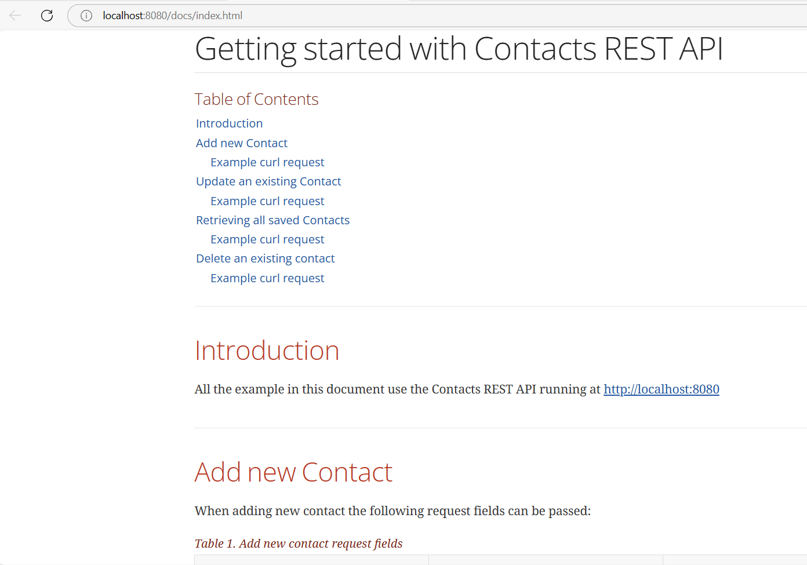

## User Guide

### Add a new contact
When you first load the application you will have zero contacts saved and a message will be displayed telling you that.

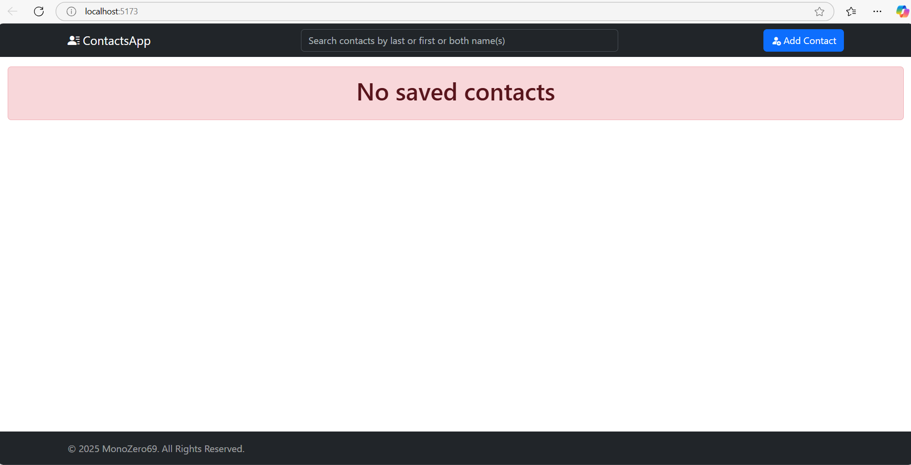

Click on the **`Add Contact`** button to load a form for new contact. 

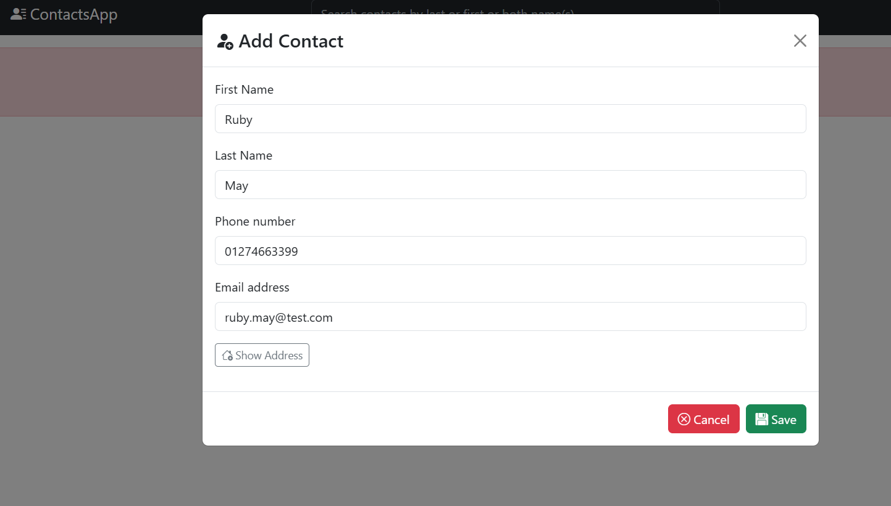

Once you have entered the contacts details you can click **`Save`** button.

Once the new contact is successfully saved you should see a message telling you that.

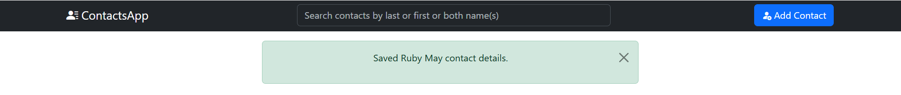

### Viewing all saved contacts
All saved contacts are shown on the main page. This gets refreshed every time you:
- start the app
- create new contact
- update existing contact
- delete a contact

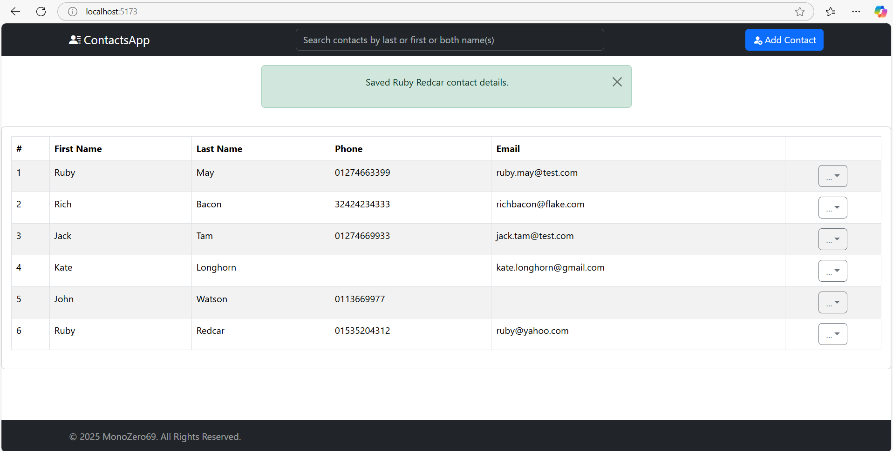

Each contact has dropdown **`actions`** menu with the following actions available:
- More info (shows more detailed view of contact i.e. Address details)
- Edit (allows you to update existing contact)
- Remove (deletes the contact permanently)

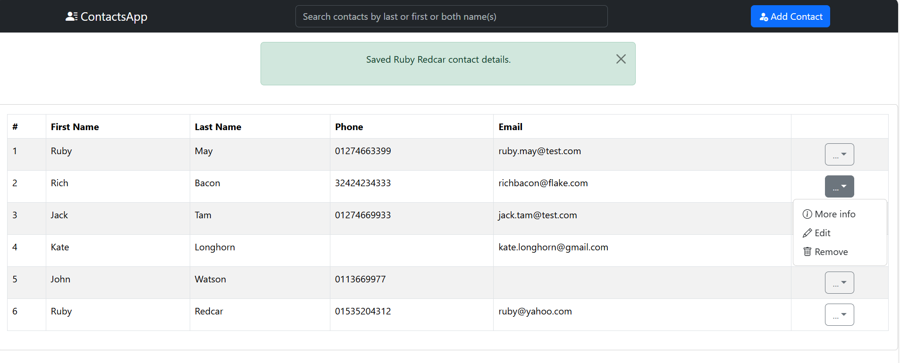

### Removing an existing contact
To remove an existing contact for example `Ruby May` contact details then you need to first click on the **`actions`** menu then select `Remove` from it.

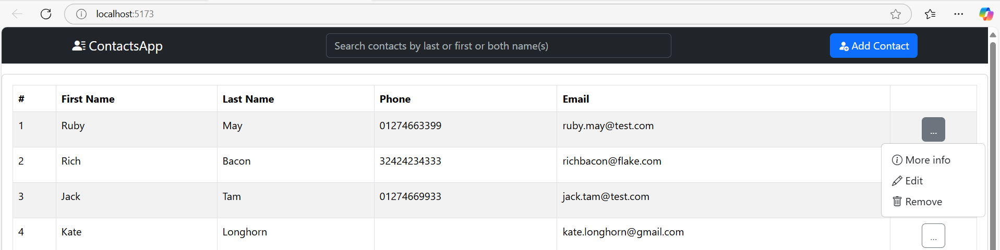

Once the contact is removed you will see a message telling you that.

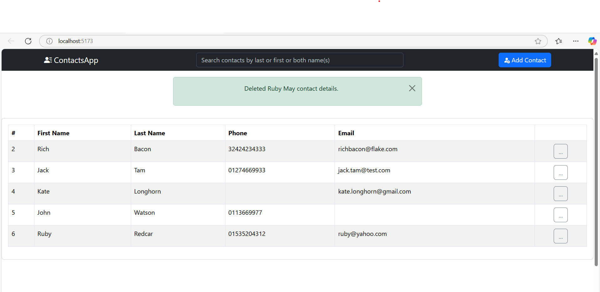

### Editing an existing contact
To edit an existing contact for example `Kate Longhorn` phone number then you need to first click on the **`actions`** menu then select `Edit` from it.

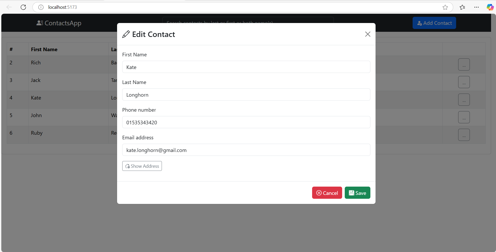

Once you have edited the required contact details you can click `Save`. Once the contact is updated you will see a message telling you that. 

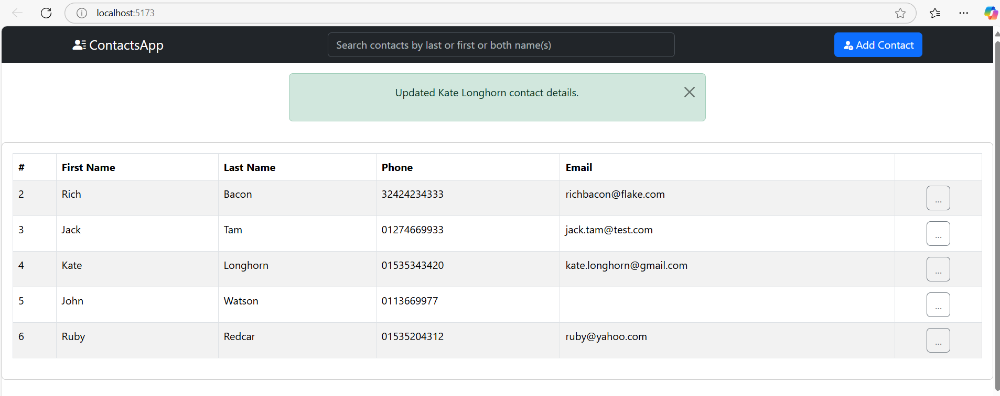

### Viewing all details for an existing contact
To view all details for an existing contact for example `Kate Longhorn` then you need to first click on the **`actions`** menu then select `More info` from it.

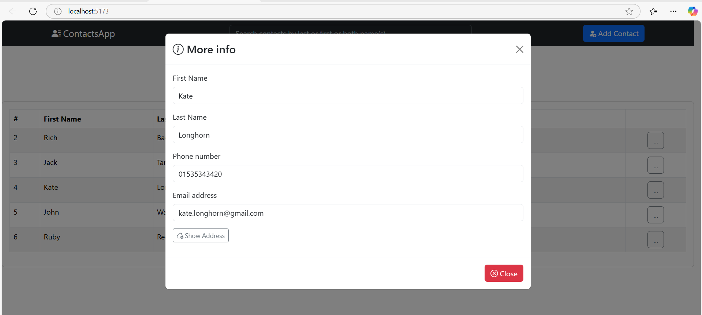

Note `More info` does not allow you to edit contact details.

## Deploying the application to production

### Recommendation of cloud platform and service
When choosing a cloud platform service numerous are available but the top 3 being:
- Amazon Web Services (AWS)
- Microsoft Azure
- Google Cloud Platform (GCP)

I making an assumption that when stakeholders are asking for recommendation of cloud platform to use for contacts web app that they want to use one of the top 3. I would recommend to use AWS as I have working experience with it.

Also I'm assuming the contacts web app (CWA) will have functionality beyond what's in the MVP like users login and accounts management (i.e. it won't be a single user app) etc..., therefore the H2 file based database will need to be replaced with Amazon Relational Database Service (Amazon RDS) as it is simple to set up, operate, back up, and scale with demand.

These are the AWS services I recommend we will need for deploying highly available contacts web app:
- AWS ELB (Elastic Load Balancing)
- AWS EC2 (Elastic Compute Cloud)
- AWS RDS (Relational Database Service)

Also we will need the following services that are not from Amazon:
- Docker Hub registry (needed for storing our published docker images of the API and Frontend)
- GitHub and GitHub Actions (CI & CD)

### High-level instructions on deploying the application to production
When giving high-level instructions on deploying the application to production I'm following the simple principles: 
- not to lock my clients into AWS and allow them to move to an another cloud provider easily if required
- automate the process of provisioning cloud infrastructure therefore `HashiCorp Terraform` will be used to define infrastructure as code (IaC) using a simple, declarative language. It supports multiple cloud providers, making it a good choice for multi-cloud environments.
- configuration of the cloud infrastructure will be done using `Ansible` an open source automation tool, it's known for its simplicity and ease of use. Ansible use YAML for configuration files, making it easy to read and write.

Our infrastructure as code (IaC) configuration files (i.e. HashiCorp Terraform, Ansible files, Helm charts etc...) will be stored in another GitHub repo as the single source of truth for infrastructure definitions, allowing us to manage infrastructure and application configurations in a consistent and automated manner. By doing this we will be implementing  GitOps, which is an operational framework that applies DevOps best practices, such as version control, collaboration, compliance, and CI/CD (Continuous Integration/Continuous Delivery), to infrastructure automation.

The key components of GitOps:
- Infrastructure as Code (IaC): All infrastructure configurations are stored as code in a Git repository.
- Pull requests (PRs): These are used as the change mechanism for all infrastructure updates, allowing for collaboration, reviews and formal approvals.
- CI/CD Pipelines: Automates infrastructure updates using a Git workflow, ensuring that changes are enacted in the environment when new code is merged. 

Once we have infrastructure as code (IaC) configuration files setup we should have automatically provisioned and configured AWS ELB, AWS EC2 instances (minimum 3 instances needed for highly available `Kubernetes cluster` but more can be added if needed) and AWS RDS.

Now we need to turn our attention to automatically deploying the API and frontend app to our Kubernetes cluster every time a pull request is merged into `main` branch:
- As changes to this Repo `main` branch go via pull requests, which has [CI](https://github.com/monozero69/contacts-web-app/actions/workflows/ci.yml) run against them ensuring that the pull request builds and all tests pass.
- Our GitHub Action CI workflow will build docker images based on changes in the `main` branch and publish them for API and frontend into `Docker Hub Registry`
- We will update the `Helm charts` in our Infrastructure as Code (IaC) GitHub Repo with new API and Frontend docker images versions via `Pull Request` created by the CI Bot.
- Once our `Helm charts` Docker images version changes PR are approved by `Humans` then GitHub Actions CD pipeline will deploy the new images into `Kubernetes cluster`

Helm charts are used to define, install, and manage Kubernetes applications. They provide a way to package Kubernetes resources into single, reusable unit called a "chart". 

The benefits of using Helm charts:
- Simplified deployment: Helm charts bundle all the Kubernetes manifests (YAML files) required to deploy an application, making it easy to deploy applications with a single command.
- Version control: Helm charts allow us to version our Kubernetes manifests, enabling us to roll back to previous versions if needed.
- Configuration management: Helm charts support templating, which allows us to customize configurations for different environments (e.g. development, staging, production) using variables.
- Dependency management: Helm charts can define dependencies on other charts, ensuring that all required components are installed together.
- Reusability: Helm charts can be shard and reused across different projects and teams, promoting consistency and reducing duplication of effort.
- Release management: Helm keeps track of all the releases of our charts, allowing us to manage updates and rollback easily.
