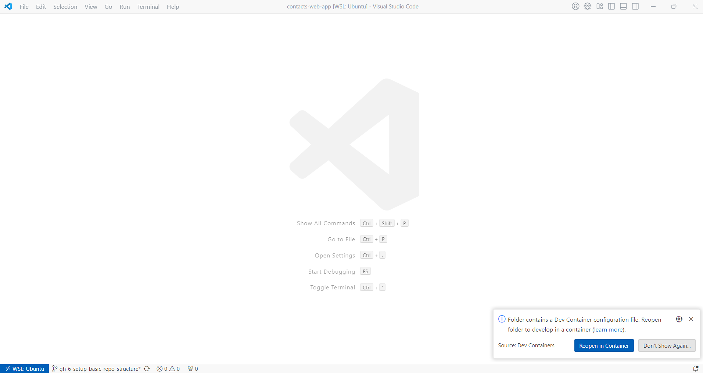
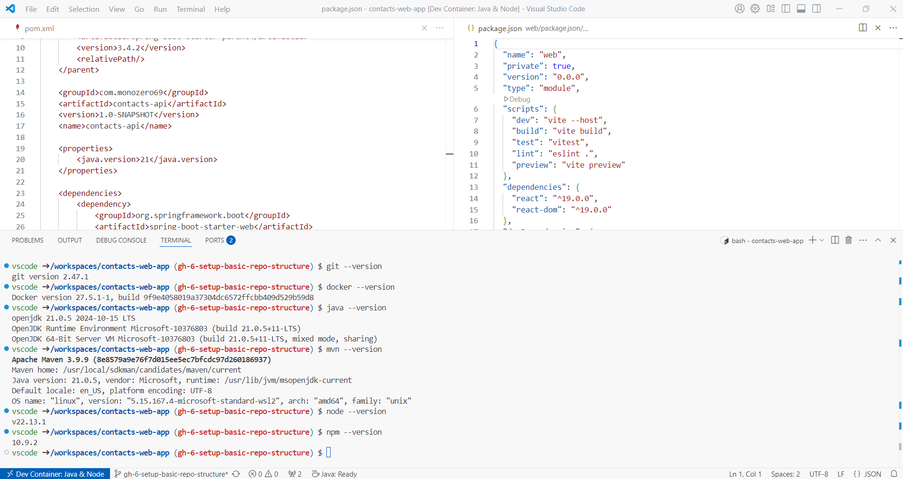

# Contacts Web App
A simple contacts web application that stores information such as name, address, and telephone numbers for contacts. 

## Setup local development environment

### Prerequisites
The following **prerequisites** are needed before you can setup local development environment:
- Git
- Docker
- Visual Studio Code (or any IDE that supports [Dev Container](https://containers.dev/supporting))
- Dev Containers extension for VS Code

Instructions for installing **prerequisites**
- [Git](https://git-scm.com/book/en/v2/Getting-Started-Installing-Git)
- [Docker](https://docs.docker.com/desktop/)
- [Visual Studio Code](https://code.visualstudio.com/docs/setup/setup-overview) (VS Code)
- [Dev Containers extension for VS Code](https://code.visualstudio.com/docs/devcontainers/tutorial)

### Clone the project from GitHub
```
git clone git@github.com:monozero69/contacts-web-app.git
```

### Enable Visual Studio Code to use the pre configured Dev Container environment
```
cd contacts-web-app
code .
```
When Visual Studio Code opens the project it will detect that the project has `.devcontainer/devcontainer.json` and will offer to `Reopen folder to develop in a container`:



Click `Reopen in Container`.

The first time you reopen the project in container it needs to build custom image on your machine with config coming from `.devcontainer/devcontainer.json` therefore it might take `few minutes` but next time you open the project in the container it will be `lot faster` as building the image step is not needed unless you make a changes to anything in the folder `.devcontainer/`. 

Once the container is running and you're connected, you should see your remote context change in the bottom left of the Status bar:



Now you have everything you need to develop, run the app and run the automated tests locally. This is the same same setup `I` have when working on this project.

The technologies stack for the project are Java, Spring Boot for the API layer and JavaScript, React for the frontend.

You will have following development tools installed in the container:
* Git*
* Docker*
* Java 21
* Maven
* NodeJS 22
* NPM

note *: The Git and Docker installed in the container are independent from ones on the outside the container. 

### Install dependencies for the API layer & frontend
The dependencies for the `API layer` & `frontend` should be automatically installed when the dev container image was created on your machine.

If you ever change dependencies in the following two files then you will need to manual install the dependencies or [rebuild dev container](https://docs.github.com/en/codespaces/developing-in-a-codespace/rebuilding-the-container-in-a-codespace#rebuilding-the-dev-container-in-the-vs-code-web-client-or-desktop-application) in VS Code to get the new dependencies installed:
* api/pom.xml (API layer)
* web/package.json (frontend layer)
#### Manual install API layer dependencies
```
cd api
mvn package
```

#### Manual install frontend layer dependencies
```
cd web
npm install
```

### Run the app locally
To run the app locally you will first need to start the `API layer` up by issuing the following commands in VS Code `terminal`:
```
cd api
mvn spring-boot:run 
```
`API layer` starts up on port `8080`


Then in another VS Code `terminal` issue the following commands to start the `frontend`:
```
cd web
npm run dev
```

The `frontend` is avaibale at http://localhost:5173/

### Run the automated tests locally
To run the `API layer` tests:
```
cd api
mvn test
```

To run the `frontend` tests:
```
cd web
npm test
``` 

### Lint the frontend layer
```
cd web
npm run lint
```

## Project management
This project uses [GitHub Projects](https://docs.github.com/en/issues/planning-and-tracking-with-projects/learning-about-projects/about-projects) to plan and track my work effectively.

To see what is currently been worked on and what has been completed so far you can look at the [Project board](https://github.com/users/monozero69/projects/2/views/1).

Before the deadline of **11:55 pm on Sunday 23rd February 2025** this project will have **minimum viable product (MVP)** completed. To see what is part of the MVP you can look at the [epic issue](https://github.com/monozero69/contacts-web-app/issues/8) for it.

The `main` branch is protected therefore to get any new changes into it you will have follow the following workflow:
* Create a new GitHub issue if there is not already an existing issue on our [backlog](https://github.com/monozero69/contacts-web-app/issues).
* The new issue will go under review & refinement and once that is done it will be put into `Ready` column on our [Project board](https://github.com/users/monozero69/projects/2/views/1)
* An issue in the `Ready` column on our project board can be picked up for development by assigning it to yourself and moving it to `In progress` column on the board.
* Create a `new feature branch` from `main` branch. The feature branch should have the prefix `gh-ISSUE_NUMBER` in its name, replace `ISSUE_NUMBER` with issue number you creating the feature branch for.
* All of your commits on the feature branch should start with the prefix `GH-ISSUE #ISSUE_NUMBER:` replace `ISSUE_NUMBER` with issue number you are working on.
* Once you ready to merge your changes from the `feature branch` into `main branch` you will need to create a new pull request on GitHub.
* The pull request description needs the following:
    1. A [keyword](https://docs.github.com/en/issues/tracking-your-work-with-issues/using-issues/linking-a-pull-request-to-an-issue#linking-a-pull-request-to-an-issue-using-a-keyword) that will link the pull request to the issue you are working on.
    2. Explain what changes have been done and why you've done them.
* Once your pull request is approved then you are ready to merge `your pull request` into `main` and the commit message needs the following:
    1. Should start with the prefix `GH-ISSUE #ISSUE_NUMBER:` replace `ISSUE_NUMBER` with issue number you are working on
    2. Everything that was in the pull request description

## Continuous Integration
The project has CI setup using [GitHub Actions](https://docs.github.com/en/actions/about-github-actions/understanding-github-actions), which builds and tests on every change on `main` branch or when there is `pull request on main` branch. The CI also runs eslint on the frontend code.

Project members can also trigger CI for any branch manual.
