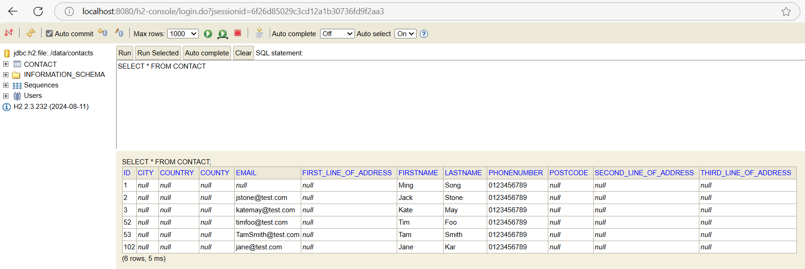

# H2 Database
The folder `contacts-web-app/api/data` contains the h2 database when running the app locally. The database file name is `contacts.mv.db`. When you clone the project from GitHub this file (i.e. contacts.mv.db) is not there as it's created the first time you start the app locally.

The file based h2 database used when running the app locally only updates the schema to match the entities. Changes will be made to the database, but existing data will be preserved.

When the app is running locally you can connect to the database using the h2 web console at the following location http://localhost:8080/h2-console the login details are the following:
- database url: `jdbc:h2:file:./data/contacts` 
- username: `blank`
- password: `blank`

When integration tests are run then an in-memory h2 database is used. The in-memory database creates the schema, destroying previous data.
